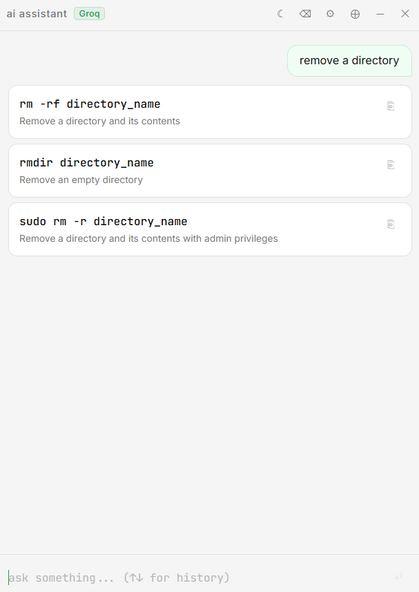

# TermAI

> A minimal floating desktop assistant that turns natural language into CLI commands.

Type what you want to do — TermAI returns 3 ready-to-run command suggestions. Click any card to copy it to your clipboard instantly.

---

## Screenshots

| Chat | Settings |
|------|----------|
|  |  |

---

## Features

- Natural language → CLI command suggestions (3 per query)
- One-click copy to clipboard
- Supports **Groq** (free & fast), **OpenAI**, and **Anthropic** providers
- Dark / Light theme toggle
- Always-on-top mode
- Minimal frameless floating window (400×550 px)
- Config saved locally — no account, no telemetry

---

## Architecture

```
┌─────────────────────────────────────────────┐
│                  TermAI                      │
│                                              │
│  ┌──────────────────────────────────────┐   │
│  │          Frontend  (React)           │   │
│  │                                      │   │
│  │  TitleBar  ──  theme / settings      │   │
│  │  Chat      ──  message history       │   │
│  │  Input     ──  user query            │   │
│  │  Card      ──  command suggestion    │   │
│  │  Setup     ──  first-launch wizard   │   │
│  │  Settings  ──  provider / model      │   │
│  └──────────────┬───────────────────────┘   │
│                 │  Wails JS bridge           │
│  ┌──────────────▼───────────────────────┐   │
│  │          Backend  (Go)               │   │
│  │                                      │   │
│  │  App.Ask()        query → API call   │   │
│  │  App.SaveConfig() persist settings   │   │
│  │  App.SaveTheme()  theme toggle       │   │
│  │  CopyToClipboard() native clipboard  │   │
│  └──────────────┬───────────────────────┘   │
│                 │  HTTPS                     │
│  ┌──────────────▼───────────────────────┐   │
│  │           AI Provider                │   │
│  │  Groq  /  OpenAI  /  Anthropic       │   │
│  └──────────────────────────────────────┘   │
└─────────────────────────────────────────────┘

Config stored at:  %USERPROFILE%\.config\termai\config.json
```

**Tech stack**

| Layer    | Technology                        |
|----------|-----------------------------------|
| Shell    | [Wails v2](https://wails.io) (Go) |
| Frontend | React 18 + Vite                   |
| Backend  | Go 1.22                           |
| AI APIs  | Groq, OpenAI, Anthropic           |

---

## Prerequisites

- [Go 1.21+](https://go.dev/dl/)
- [Node.js 18+](https://nodejs.org/)
- [Wails CLI v2](https://wails.io/docs/gettingstarted/installation)

```sh
go install github.com/wailsapp/wails/v2/cmd/wails@latest
wails doctor
```

---

## Setup

```sh
cd ai-assistant
go mod tidy
```

---

## Run in dev mode

```sh
wails dev
```

Starts a live-reload window with hot module replacement.

---

## Build (Windows `.exe`)

```sh
wails build
```

Output: `build/bin/TermAI.exe`

---

## First launch

On first launch a setup screen appears:

1. Pick a provider — **Groq** (recommended, free), **OpenAI**, or **Anthropic**
2. Paste your API key
3. Click **Start**

Config is saved to `%USERPROFILE%\.config\termai\config.json`:

```json
{
  "provider": "groq",
  "api_key": "gsk_...",
  "model": "llama-3.1-8b-instant",
  "theme": "dark"
}
```

Delete this file to reset and show the setup screen again.

---

## Usage

Type a natural language description and press **Enter**:

```
remove a directory
find all files larger than 100MB
kill a process by name
check disk usage
list open ports
compress a folder into a zip
```

TermAI returns 3 command suggestions. Click any card to copy the command.

---

## API Keys

| Provider  | Where to get                         | Default model            |
|-----------|--------------------------------------|--------------------------|
| Groq      | https://console.groq.com/keys        | llama-3.1-8b-instant     |
| OpenAI    | https://platform.openai.com/api-keys | gpt-4o-mini              |
| Anthropic | https://console.anthropic.com/       | claude-sonnet-4-20250514 |

---

## Project structure

```
ai-assistant/
├── app.go              # Go backend — API calls, config, clipboard
├── main.go             # Wails app bootstrap
├── go.mod
├── wails.json
├── build/
│   ├── appicon.png
│   └── windows/
│       └── icon.ico
└── frontend/
    ├── index.html
    ├── package.json
    └── src/
        ├── App.jsx
        ├── App.css
        └── components/
            ├── TitleBar.jsx
            ├── Chat.jsx
            ├── Input.jsx
            ├── Card.jsx
            ├── Setup.jsx
            └── Settings.jsx
```

---

## License

MIT
